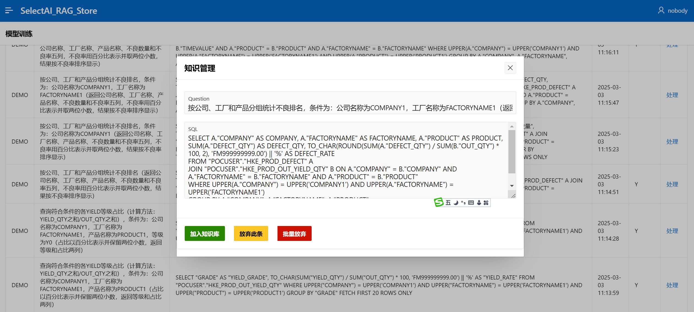
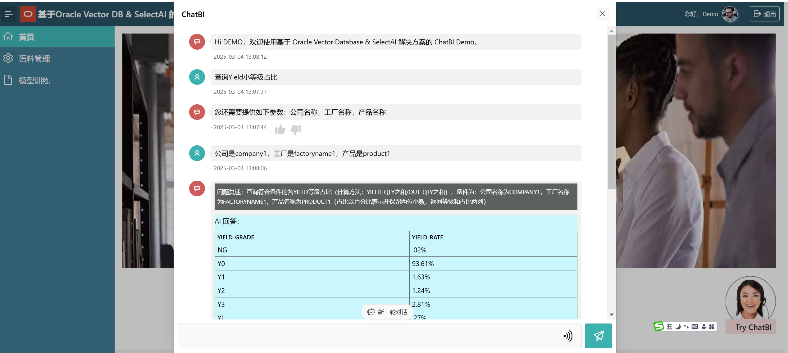

# 介绍

AiReport Project。此项目主要使用自己部署的大语言模型、Oracle数据库（包括向量、JSON、关系）实现文生SQL(text2sql)，以及采用 RAG 的方式来解决 SQL 生成的正确率问题，通过RAG来达到持续训练持续提升准确率的效果。Text2SQL 及 RAG 引擎部分采用 PLSQL 实现，中间逻辑控制部分采用 Python 实现，前端页面采用 Oracle APEX 低代码实现。

## 界面
### RAG 知识库管理界面 (Oracle APEX 实现)
RAG知识库维护界面的内容来自于系统自动记录的处理日志，通过RAG知识库维护界面，管理员可以将有代表性的问题以及系统生成的SQL语句（可修改）加入到知识库（向量库）中，以达到持续训练RAG的目标。



### 用户聊天界面 (Oracle APEX 实现)



## Python版本

运行该程序需要 Python 3.12。例如，可以使用 conda 或 poetry 创建一个 python 虚拟环境：

conda create -n aireport python=3.12

## 数据库配置
### 创建数据库对象
安装顺序如下（./engine 目录下）：
1. 执行 CUSTOM_SELECT_AI_TABLES.sql
2. 执行 CUSTOM_SELECT_AI.pkg.sql
3. 执行 CUSTOM_SELECT_AI.pkb.sql

执行完以上三步，就代表安装完成，完成如下的配置后，就可以直接使用了。

## LLM 配置
### 配置大语言模型提供商
下例配置了使用通义千问的云服务。也可以使用其它厂商的或自己部署的LLM。要求是配置OpenAI兼容的接口。

以下以自己部署的大模型为例。

#### 部署大语言模型LLM
关于安装 vLLM，不再赘述。

部署 Qwen2.5-Coder-14B-Instruct-AWQ 模型到 A10（单台就可以部署起来）
```shell
nohup python -u -m vllm.entrypoints.openai.api_server --port 8098 --model Qwen/Qwen2.5-Coder-14B-Instruct-AWQ --served-model-name Qwen2.5-Coder-14B-Instruct-AWQ --device=cuda --dtype auto --max-model-len=8192 > vllm.out 2>&1 &
```

允许数据库访问 LLM 服务器（简单起见，这里直接给了 *，代表所有地址都允许访问）
```sql
BEGIN
   -- allow connecting to outside hosts
    DBMS_NETWORK_ACL_ADMIN.APPEND_HOST_ACE(
        host => '*',
        ace => xs$ace_type(privilege_list => xs$name_list('connect'),
                           principal_name => 'HYSPOC',
                           principal_type => xs_acl.ptype_db));
END;
/
```

部署完成后，测试一下的接口的连通性：
```shell
curl http://132.145.95.18:8098/v1/chat/completions \
    -H "Content-Type: application/json" \
    -d '{
        "model": "Qwen2.5-Coder-14B-Instruct-AWQ",
        "messages": [
            {"role": "system", "content": "You are a helpful assistant."},
            {"role": "user", "content": "Tell me something about large language models."}
        ]
    }'
```

### 创建 Provider，指向自己部署的模型
```sql
BEGIN
  CUSTOM_SELECT_AI.CREATE_PROVIDER(
		p_provider    =>    'qwen',
		p_endpoint    =>    'http://132.145.95.18:8098/v1/chat/completions',
		p_auth        =>    'EMPTY'
	);
END;
/
```

### 创建 Profile，指定需要利用哪些数据库对象 以及 用来生成SQL 的 LLM 模型名称
Profile指定了使用哪个模型，以及Text2SQL时需要用到的数据库对象（表或视图）。
```sql
BEGIN
	CUSTOM_SELECT_AI.CREATE_PROFILE(
      p_profile_name    =>'HKE_DEMO',
      p_description     => 'SelectAI DEMO for HKE',
      p_attributes      => '{
          "provider": "qwen",
          "model" : "Qwen2.5-Coder-14B-Instruct-AWQ",
          "object_list": [{"owner": "POCUSER", "name": "HKE_PROD_DEFECT"},
                          {"owner": "POCUSER", "name": "HKE_PROD_OUT_YIELD_QTY"}
                          ]
      }'
    );
END;
/
```

## 接口及样例
### CHAT接口 - 直接与 LLM 聊天
```sql
select CUSTOM_SELECT_AI.CHAT(
    p_profile_name => 'HKE_DEMO',
    p_text => 'hello'
);
```

### SHOWSQL接口 - 自然语言生成SQL
此方法将自然语言生成对应的SQL语句
```sql
select CUSTOM_SELECT_AI.SHOWSQL(
  	p_profile_name => 'HKE_DEMO',
  	p_text => '查询符合条件的各YIELD小等级占比（即YIELD_QTY之和/OUT_QTY之和），条件为：公司名称为COMPANY1，工厂名称为FACTORYNAME1，产品名称为PRODUCT1。占比用百分比表示并排序，用中文别名返回。'
);
```

## 配置应用

### Python包依赖

pip install -r requirements.txt

### 环境变量配置

服务启动时，会从文件 app.env 中读取环境变量信息。

### 启动程序

start.sh: 启动或重启。如果程序已经在运行，那么运行start.sh时将先杀掉正在运行的进程，再启动新的进程。

### GUI

https://wdsshsl4d6foyhp-cntech.adb.ap-chuncheon-1.oraclecloudapps.com/ords/r/hys/chatbi185/home (demo/Demo123#)


## 演示脚本

YIELD小等级占比：
对话流程：
1. 输入 “查询company1公司生产的product1产品各YIELD小等级占比”
2. 请提供您需要查询的工厂名称？===> 输入“factoryname1”
3. 继续输入 “company2公司生产的product2呢”
4. 完成对话。


不良排名：
对话流程：
1. 输入 “显示不良排名”
2. 继续输入 “只显示company1公司的”
3. 继续输入 “只显示product1的”
3. 继续输入 “只显示product2的”


## 附
配置使用云厂端API服务，供参考

```sql
----- Create service provider
BEGIN
  CUSTOM_SELECT_AI.CREATE_PROVIDER(
		p_provider    =>    'qwen',
		p_endpoint    =>    'https://dashscope.aliyuncs.com/compatible-mode/v1/chat/completions',
		p_auth        =>    'sk-75229e7exxxxxxxxxxxxxxxxxxxxxxxx'
	);
END;
/

----- Create profile
BEGIN
	CUSTOM_SELECT_AI.CREATE_PROFILE(
      p_profile_name    =>'HKE_DEMO',
      p_description     => 'SelectAI DEMO for HKE',
      p_attributes      => '{
          "provider": "qwen",
          "model" : "qwen-max-2025-01-25",
          "object_list": [{"owner": "POCUSER", "name": "HKE_PROD_DEFECT"},
                          {"owner": "POCUSER", "name": "HKE_PROD_OUT_YIELD_QTY"}
                          ]
      }'
    );
END;
/
```
